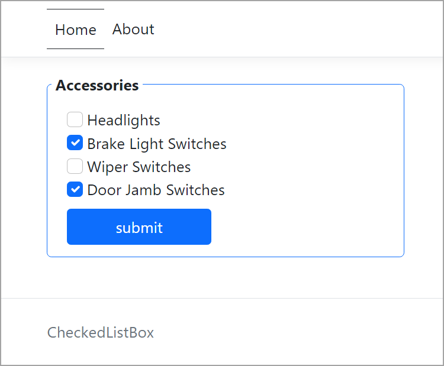
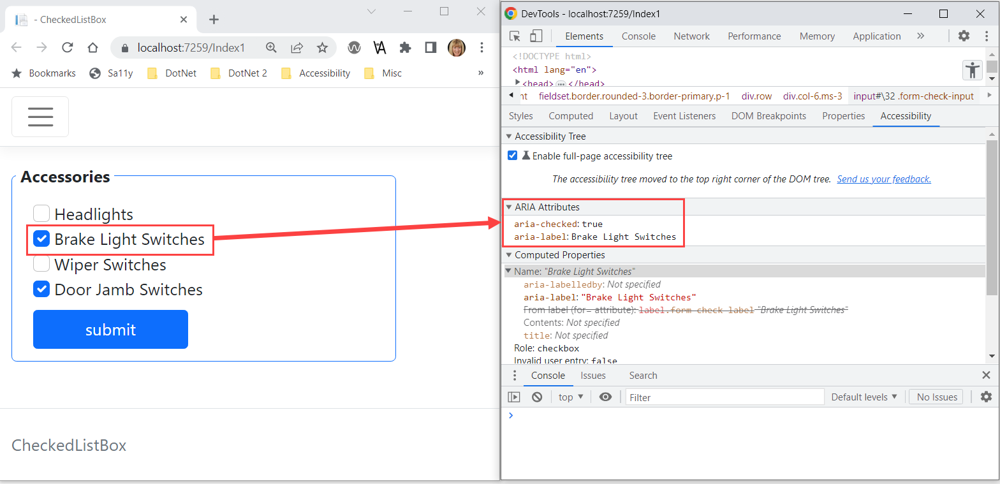

# ASP.NET Core/Razor pages working with Checkboxes

There are two lessons, how to create a list of checkboxes and also how to set aria-checked for each checkbox using JavaScript.

> **Note**
> aria-checked The aria-checked attribute indicates whether the element is checked (true), unchecked (false), or if the checked status is indeterminate (mixed), meaning it is neither checked nor unchecked.

## Finished page



## Data

In code the following model is used to represent automobile parts with just enough properties for rendering checkboxes and on post have the primary key for each selected part selected by the visitor.

```csharp
public class AutoPart
{
    public int Id { get; set; }
    public string Name { get; set; }
}
```

## Mocked data

So there are no external dependences e.g. a database, static data is used.

```csharp
public class MockedData
{
    /// <summary>
    /// For a real app data would come from a data source eg. database
    /// </summary>
    public static List<AutoPart> PartsList() =>
        new()
        {
            new () { Id = 1, Name = "Headlights" },
            new () { Id = 2, Name = "Brake Light Switches" },
            new () {Id = 3, Name = "Wiper Switches" },
            new () {Id = 4, Name = "Door Jamb Switches" }
        };
}
```

## Rendering data with checkboxes

### Code behind

Using the following model, setup a list property.

```csharp
public class ServiceModel
{
    public int Id { get; set; }
    public string Name { get; set; }
    public bool Checked { get; set; }
    public override string ToString() => $"{Id}  {Name}  {Checked}";
}
```

The property

```csharp
public class Index1Model : PageModel
{
    [BindProperty]
    public List<ServiceModel> CheckModels { get; set; }
```

Next, use the following method to populate CheckModels.

```csharp
public Index1Model()
{
    LoadParts();
}

private void LoadParts()
{
    CheckModels = new List<ServiceModel>();
    foreach (var part in MockedData.PartsList())
    {
        CheckModels.Add(part.Id % 2 == 0
            ? new ServiceModel() { Id = part.Id, Name = part.Name, Checked = true }
            : new ServiceModel() { Id = part.Id, Name = part.Name });
    }
}
```

### Frontend code

- @Html.HiddenFor keeps a reference to the identity for each part
- @Html.CheckBoxFor
    - An anonymous object for storing
        - The part identifier
        - form-check-input the Bootstrap class for rendering the checkbox, not this is also used in JavaScript below to provide dynamic toggling for aria-checked attribute
        - Set the initial value for aria-checked
        - Set the initial value for aria-label

:stop_sign: **Important** 

- Note that setting an aria attribute use an underscore rather than a hyphen, Visual Studio will handle the conversion.
- Some parts will be set to true while others to false, once the page has been rendered and a checkbox check state changes without the proper JavaScript the aria-checked property will not change.

```csharp
@for (var index = 0; index < Model.CheckModels.Count(); index++)
{

    <div class="row">

        <div class="col-6 ms-3">
            @* note setting initial value of aria-checked using aria_checked*@
            @Html.HiddenFor(item => @Model.CheckModels[index].Id)
            @Html.CheckBoxFor(item => @Model.CheckModels[index].Checked,
                new
                {
                    @id = @Model.CheckModels[index].Id,
                    @class = "form-check-input",
                    aria_checked = @Model.CheckModels[index].Checked.ToString().ToLower(),
                    aria_label = @Model.CheckModels[index].Name,
                })

            <input type="hidden" asp-for="@Model.CheckModels[index].Name"/>
            <label class="form-check-label"
               for="@Model.CheckModels[index].Id" aria-labelby="@Model.CheckModels[index].Id">
                 @Model.CheckModels[index].Name
            </label>

        </div>

    </div>

}
```

### JavaScript

The following code assigns a click event for each checkbox, if the checkbox is set to true, aria-checked is set to true while when the checkbox is unchecked its aria-check is set to false.

```javascript
var $checkboxHelper = $checkboxHelper || {};
$checkboxHelper = function () {
    var setupCheckboxesClickEvents = function (checkboxes) {
        
        for (let index = 0; index < checkboxes.length; index++) {

            checkboxes[index].onclick = function () {

                if (checkboxes[index].getAttribute('aria-checked') === 'true') {
                    checkboxes[index].setAttribute('aria-checked', 'false');
                } else {
                    checkboxes[index].setAttribute('aria-checked', 'true');
                }
            };
        }
    }

    // for testing 
    var setCheckboxesAriaChecked = function (checkboxes) {

        for (let index = 0; index < checkboxes.length; index++) {
            checkboxes[index].onclick = function () {
                checkboxes[index].setAttribute('aria-checked', 'false');
            };
        }
    }


    return {
        initialize: setupCheckboxesClickEvents,
        setAriaCheckedFalse: setCheckboxesAriaChecked
    };
}();
```

The following code run the method above in document load of the page

```html

@section Scripts
    {
    <script>
        document.addEventListener("DOMContentLoaded", () => {
            $checkboxHelper.initialize(document.getElementsByClassName("form-check-input"));
        });
    </script>
}
```

### Watch aria-checked

Open developer tools in your browser and toggle a checkbox, below is with Chrome developer tools.



### On Post

The code asserts there are checked items and if so display them else write out none were checked.


```csharp
public Task<IActionResult> OnPostResendAsync()
{
    var checkedItems = CheckModels.Where(x => x.Checked).ToList();

    if (checkedItems.Any())
    {
        Log.Information("Checked items on Index1 post");
        foreach (var model in checkedItems)
        {
            Log.Information("Id: {Id} Name: {name}", model.Id, model.Name);
        }
    }
    else
    {
        Log.Information("Nothing check for index1 post");
    }


    return Task.FromResult<IActionResult>(RedirectToPage("Index1"));
}
```

### Source code

Clone the following GitHub [repository](https://github.com/karenpayneoregon/razor-pages-checkboxes).